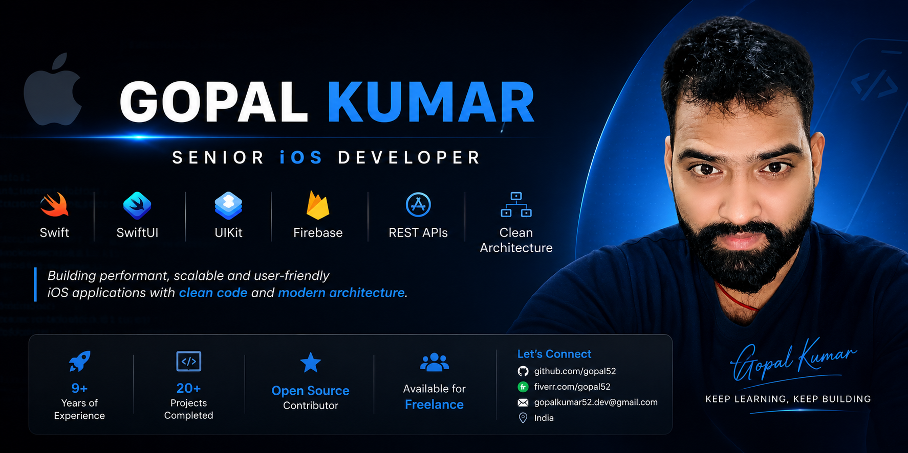

  

# Hi there 👋, I'm Gopal Kumar

## 🚀 Senior iOS Developer

I am a passionate iOS Developer with 9+ years of experience building high-quality mobile applications using Swift, SwiftUI, UIKit, and Objective-C. I enjoy creating clean, scalable, and user-friendly apps.

---

## 👨‍💻 About Me

- 📱 Senior iOS Developer
- 💼 Open for Freelance Projects
- 🌱 Currently learning AI integration in iOS
- 🔥 Passionate about SwiftUI & Clean Architecture
- 📍 India

---

## 🛠 Tech Stack

### Languages
- Swift
- Objective-C

### Frameworks
- SwiftUI
- UIKit
- Combine
- Core Data
- AVFoundation
- MapKit

### Backend & APIs
- REST APIs
- Firebase
- JSON

### Tools
- Xcode
- Git
- GitHub
- CocoaPods
- Swift Package Manager
- Fastlane

---

## 📌 Featured Projects

### 🌦 GlassCast Weather App
Modern weather application built using SwiftUI with clean architecture.

### 📱 iNExt
Production iOS application with modern UI and scalable architecture.

---

## 📫 Contact

- Fiverr: https://www.fiverr.com/gopal52
- GitHub: https://github.com/gopal52

---

⭐ Thanks for visiting my profile!
